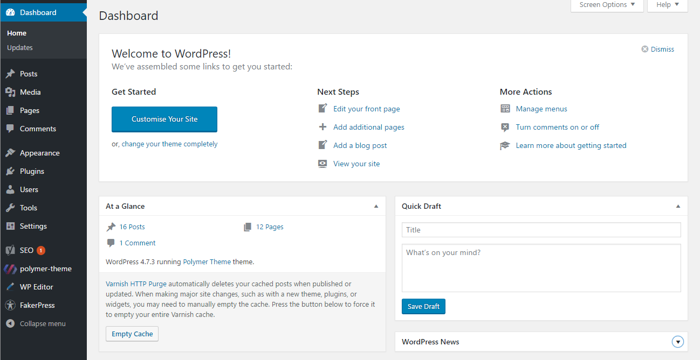
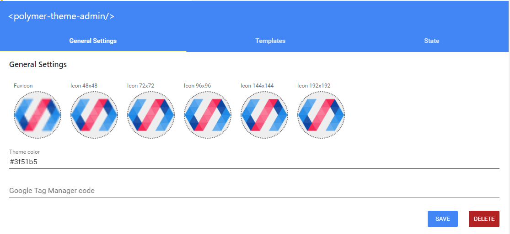
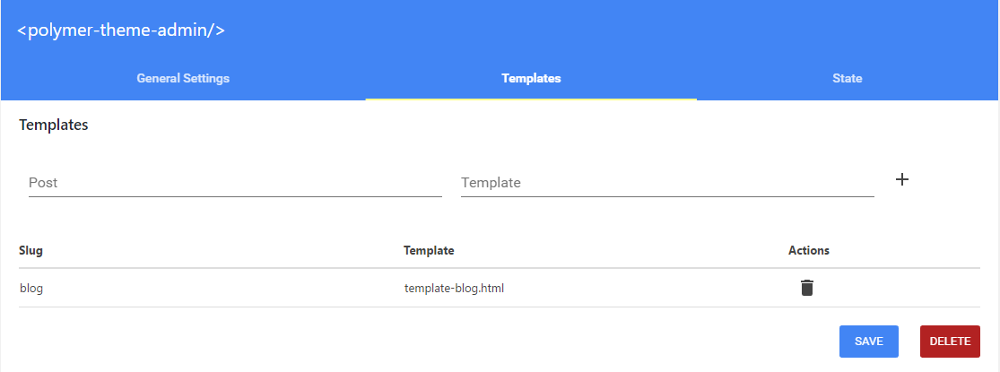

# Polymer SPA Theme for Wordpress

This theme aims to be a starting point to develop a Polymer SPA applications using Wordpress to feed it. It's based on the Polymer's team `Polymer starting Kit`.

It is still in development stage and some bugs may appear.

* [Installation](#installation)
    * [Basic installation](#basic-installation)
    * [Advanced installation](#advanced-installation)
* [File structure](#file-structure)
* [Admin and configuration](#admin-and-configuration)
    * [General Settings](#general-settings)
    * [Templates](#templates)
    * [State](#state)
* [Custom elements](#custom-elements)
    * [polymer-theme-shell](http://wp.trofrigo.me/elements/polymer-theme-shell)
    * [polymer-theme-route](http://wp.trofrigo.me/elements/polymer-theme-route)
    * [polymer-theme-wp-api](http://wp.trofrigo.me/elements/polymer-theme-wp-api)
    * [polymer-theme-network-checker](http://wp.trofrigo.me/elements/polymer-theme-network-checker)
    * [polymer-theme-icons](http://wp.trofrigo.me/elements/polymer-theme-icons)
    * [polymer-theme-shared-styles](http://wp.trofrigo.me/elements/polymer-theme-shared-styles)
    * [polymer-theme-html](http://wp.trofrigo.me/elements/polymer-theme-html)
* [Templates](#templates)
    * [Understanding the templates system](#understanding-the-templates-system)
    * [Template hierarchy](#template-hierarchy)
    * [template-blog](#template-blog)
    * [template-page-detail](#templates-page-detail)
    * [template-post-detail](#templates-post-detail)

## Installation

### Basic installation

* Clone this repository in your server; `git clone https://github.com/trofrigo/polymer-theme.git`
* Install the theme's bower dependencies. Execute `bower install` in the root of this project. In order to this,
[Bower](https://bower.io/#install-bower) must be installed.
* Install and activate this theme into your [Wordpress](https://wordpress.org) installation.
* Create a page called Blog. This is needed in order to be able to edit the blog's title and description.

If you are using a Wordpress installation previous to the 4.7.3 version, you have to install the
[WP REST API](http://v2.wp-api.org/) as well.

### Advanced installation

In order to improve the user final experience and daily blog's workflow, some plugings an third party software may  be
installed.

[Varnish](https://varnish-cache.org/) caches all the API requests, improving the speed transition between pages.

[WP EDITOR](https://wordpress.org/plugins/wp-editor/) let you edit and create files and directories inside yours
Wordpress backoffice. This allows you to create edit custom element's files.

## File structure
The whole Polymer's application can be found into the `src/` folder. There you will find three folders `admin/`, `core/`
and `templates/`.

The `admin/` folder contains all the [admin's application](#admin-and-configuration) that allows you to edit the themes's
configuration.

All the templates must be placed into the `templates/` folder. This templates ships with some of them:
* `template-blog.html`
* `template-blog-detail.html`
* `template-page-detail.html`

Theme's core is placed into the `core/` folder. There you will find some [elements](#custom-elements) used by this theme,
that you can reuse in your own [templates](#templates) or elements.

## Admin and configuration

Once this theme is installed, you will find inside your Wordpress backoffice, a new option `polymer-theme`:

Inside this new page you will find 3 tabs:

### General Settings

This first tab manages some general settings as for example:

* SPA icons. Allows you define several icons sizes.
* Theme color. That's the color used for some browser to color its navbar.
* Google Tag Manager. By default, this theme ships with Google Tag Manager ready to use.

### Templates

Every time that this themes try to resolve a url, uses [some to rules](#understanding-the-templates-system) to infer a
proper template. Those general rules can be overwritten for any page or post in your site.

Every time that a post or page is created, or every time that a new template is added into the `src/templates/` folder,
it will appear as an options inside the select elements.

### State

This theme uses the [Google's UniFlow](https://google.github.io/uniflow-polymer/) element to work with inner state of
the application. There are two kind of values inside the application state, those required by the application itself
and those required by the user.

Every element that implements the `UniFlow.StateAware`, will be notified every time that the state changes.

If the user needs a value set a value, it can be add in this section. Those values will be available inside the custom
attribute of the application's state.

    <dom-module id="my-element">
        <template>
            

            <h1>state.custom.myValue</h1>

        </template>
        Polymer({
              is: 'my-element',

              behaviors: [
                UniFlow.StateAware
              ]
        });
    </dom-module>

## Custom elements
### [polymer-theme-shell](http://wp.trofrigo.me/elements/polymer-theme-shell)
### [polymer-theme-route](http://wp.trofrigo.me/elements/polymer-theme-route)
### [polymer-theme-wp-api](http://wp.trofrigo.me/elements/polymer-theme-wp-api)
### [polymer-theme-network-checker](http://wp.trofrigo.me/elements/polymer-theme-network-checker)
### [polymer-theme-icons](http://wp.trofrigo.me/elements/polymer-theme-icons)
### [polymer-theme-shared-styles](http://wp.trofrigo.me/elements/polymer-theme-shared-styles)
### [polymer-theme-html](http://wp.trofrigo.me/elements/polymer-theme-html)

## Templates

### Understanding the templates system
Every time the route changes, the [shell](http://wp.trofrigo.me/elements/polymer-theme-shell) tries to infer the most appropriate template.
To do this, the shell fetch the information that Wordpress has for this url using the
[polymer-theme-route](http://wp.trofrigo.me/elements/polymer-theme-route). This information is eventually passed to the template,
that is the info that is typically into the [Wordpress's Loop](https://codex.wordpress.org/The_Loop).

Once the template is selected, the shell call to an `init` method that the must implement that receives a param with the Loop's info.
At this point, the shell waits to the template to fire a method called `ready`, that notifies that template is ready to be shown.

In a simple example, a template receives the Loop info, bind it, and notifies that is ready to go.

    Polymer({
        is: 'post-detail',
        init: function (item) {
            this.set('item', item);
            this.fire('ready');
        }
    });

In a more complex example, a template that renders a page, may need to find all page's children. In this case the template needs
to fetch this children information in order to be ready.

    Polymer({
        is: 'page-children',
        init: function (item) {
            this.wp.pages().param('parent', item.id)
                .then(function (response) {
                    this.set('children', response);
                    this.fire('ready');
                }.bind(this));
        }
    });

Note in this last example, the templates uses the [polymer-theme-wp-api](http://wp.trofrigo.me/elements/polymer-theme-wp-api)
to fetch this information.

### Template hierarchy
This theme tries to mimic the Wordpress template behaviour. Every time the route changes, theme's router will find
what the `taxonomy` and the `slug` of the next view is. Once those params are determinated, the shell will try to find a
template for the view.

First of all will look for [custom rule](#templates) for this slug,
if this rule does not exist, will resolve into `templates/template-{taxonomy}-detail.html`.

This hierarchy allows the user to set a default view for a taxonomy detail (typically `post-detail` and `page-detail`)
and also overwrite it for any special post, just creating a [new rule](#templates).

### [template-blog](https://github.com/trofrigo/polymer-theme/blob/master/src/templates/template-blog.html)
### [template-page-detail](https://github.com/trofrigo/polymer-theme/blob/master/src/templates/template-page-detail.html)
### [template-post-detail](https://github.com/trofrigo/polymer-theme/blob/master/src/templates/template-post-detail.html)

## Changelog

### v0.1.0
* First theme's version

## Contributing

1. Fork it!
2. Create your feature branch: `git checkout -b my-new-feature`
3. Commit your changes: `git commit -am 'Add some feature'`
4. Push to the branch: `git push origin my-new-feature`
5. Submit a pull request :D

## License

Copyright (c) 2017 Rodrigo Sancho

Licensed under the [MIT license](https://github.com/trofrigo/polymer-theme/blob/master/LICENSE).

